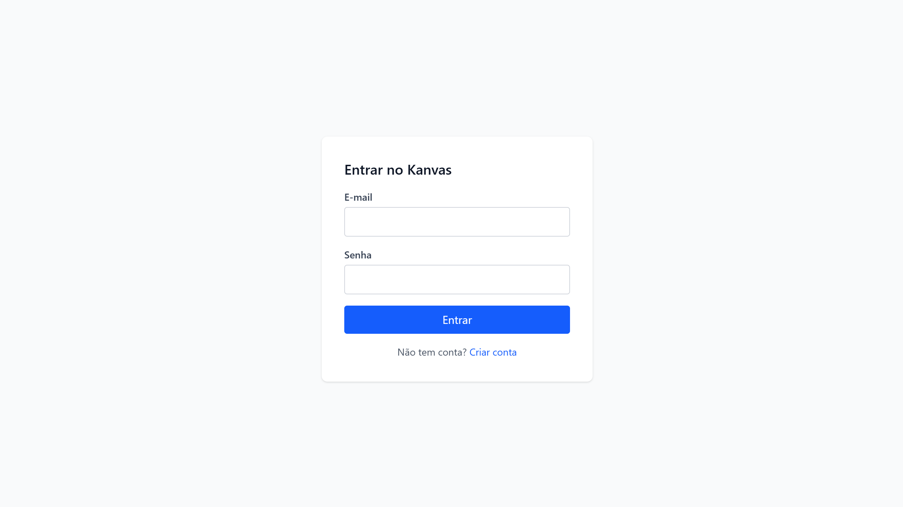
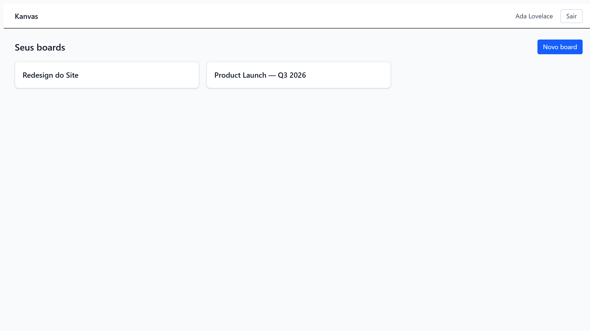
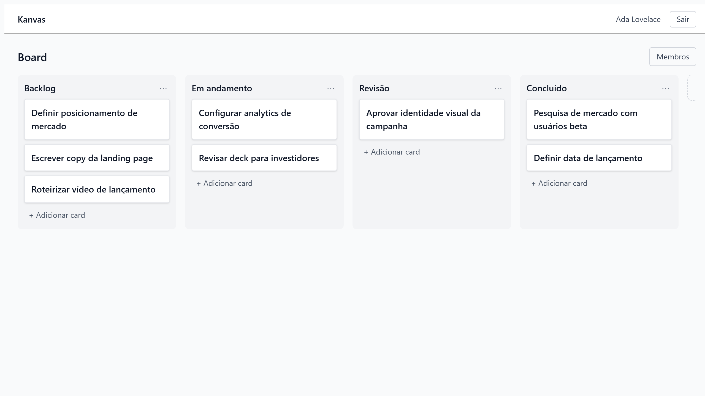
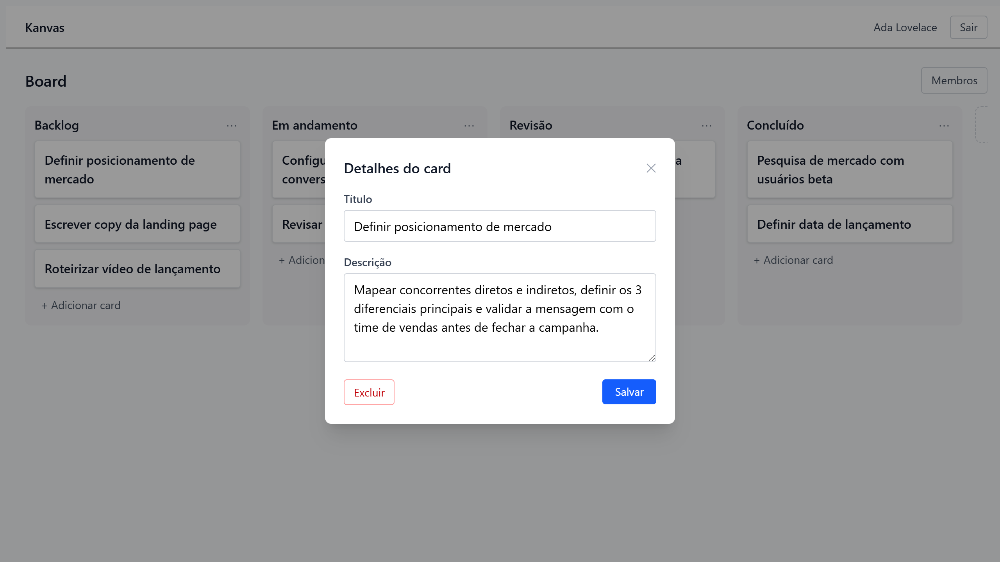
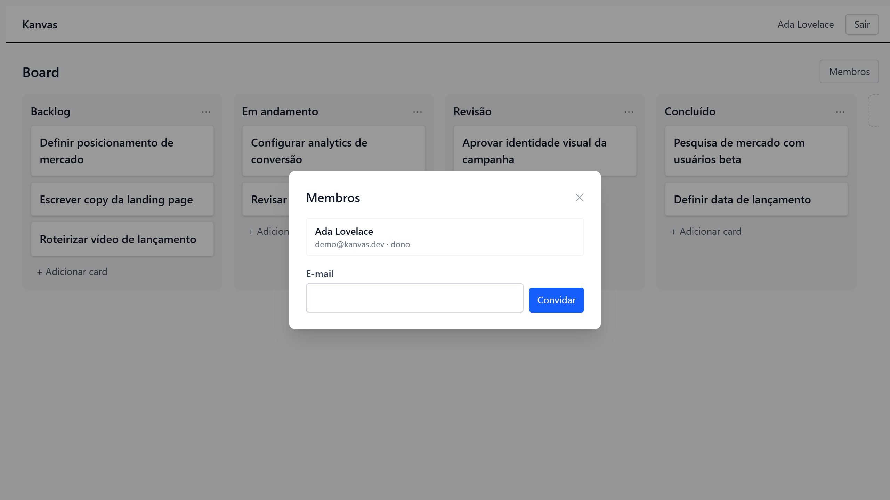

# Kanvas

**A real-time collaborative Kanban board — built end-to-end (backend, frontend, tests, CI/CD, and production deploy) as a portfolio project.**

[](https://github.com/MatheusCavalari/kanvas/actions/workflows/backend-ci.yml)
[](https://github.com/MatheusCavalari/kanvas/actions/workflows/frontend-ci.yml)
[](https://github.com/MatheusCavalari/kanvas/actions/workflows/e2e-ci.yml)
[](LICENSE)

**🔗 Live demo:** [kanvas-frontend-xmez.onrender.com](https://kanvas-frontend-xmez.onrender.com)
*(free-tier backend — the first request after a period of inactivity can take a few seconds to wake up)*

---

## What it is

Kanvas is a Trello/Jira-style Kanban board: boards, columns, and cards, with
members you can invite and drag-and-drop reordering — kept in sync in
**real time** across every browser tab connected to the same board, over a
WebSocket. It's a from-scratch, full-stack build meant to show engineering
practices end-to-end rather than to compete on features:

- **Clean/Hexagonal architecture** on the backend, domain logic tested against
  fakes, no ORM
- **Deep test coverage**: Go unit + Postgres integration tests, frontend
  component tests, and Playwright end-to-end tests exercising the real app
  through a browser
- **Live collaboration** via a WebSocket hub that pushes board mutations to
  every connected client, with automatic reconnect/resync
- **A real CI/CD pipeline**: lint + test + build on every push, end-to-end
  tests against a Dockerized stack, and automatic production deploys

## Screenshots

| | |
|---|---|
|  **Auth** |  **Board list** |
|  **Kanban view** |  **Card detail** |
|  **Members panel** | |

*(Screenshots are from the live demo above, with sample data.)*

## Features

- **Auth**: register / login / logout, JWT access token + httpOnly refresh
  cookie, transparent silent refresh on expiry
- **Boards**: create, rename, delete; owner and member roles
- **Members**: invite by email, remove, role-gated actions (only the owner
  can invite/remove/delete the board)
- **Columns & cards**: create, rename, delete, edit description; drag-and-drop
  to reorder columns and move cards within or across columns, with the new
  order persisted
- **Realtime sync**: every mutation (by you or a teammate) shows up live in
  every open tab on that board, via WebSocket — no polling, no manual refresh
- **Resilience**: the client auto-reconnects and resyncs its state if the
  WebSocket drops

## Tech stack

| | |
|---|---|
| **Backend** | Go 1.23 · [chi](https://github.com/go-chi/chi) router · [sqlc](https://sqlc.dev/) + [pgx](https://github.com/jackc/pgx) (no ORM) · JWT auth · [coder/websocket](https://github.com/coder/websocket) · PostgreSQL |
| **Frontend** | React 19 · TypeScript · Vite · Tailwind CSS v4 · React Router · [TanStack Query](https://tanstack.com/query) · Zustand · [dnd-kit](https://dndkit.com/) |
| **Testing** | Go `testing` + [testcontainers-go](https://testcontainers.com/) (Postgres integration tests) · Vitest + Testing Library · [Playwright](https://playwright.dev/) (E2E) |
| **Infra** | Docker + Docker Compose (local dev) · GitHub Actions (CI: lint, unit, integration, E2E) · [Render](https://render.com) (production: Docker web service + static site + managed Postgres, via a [Blueprint](https://render.com/docs/blueprint-spec)) |

See [`backend/README.md`](backend/README.md) and
[`frontend/README.md`](frontend/README.md) for the full API reference and
frontend architecture notes.

## Architecture

```
kanvas/
  backend/
    cmd/api/            entry point
    internal/
      auth/              domain, service, repo, HTTP handlers
      board/             boards & members
      card/               columns & cards
      realtime/           WebSocket hub + event publisher
      platform/            shared infra: db, jwt, middleware, config, router
    db/
      migrations/         golang-migrate SQL migrations
      queries/             sqlc source queries
  frontend/
    src/
      api/                 HTTP client + per-domain API functions
      features/
        auth/               login/register, session store
        boards/              board list
        board/                kanban view: columns, cards, drag-and-drop, WebSocket hook
      components/          reusable UI (modal, layout)
  e2e/                    Playwright end-to-end tests
```

Each backend domain (`auth`, `board`, `card`) follows the same layering:
`domain.go` (pure business rules) → `service.go` (use cases, depends on a
repository **interface**) → `repository_postgres.go` (sqlc-backed
implementation) → `handler.go` (chi HTTP handlers). This inversion lets
`service.go` be unit-tested against an in-memory fake repository, with no
database in the loop.

On the frontend, [TanStack Query](https://tanstack.com/query) owns all
server state (boards/columns/cards) and its cache is patched directly by
incoming WebSocket events — no refetch needed when a teammate makes a change.

Full design rationale: [`docs/superpowers/specs/2026-08-10-kanvas-design.md`](docs/superpowers/specs/2026-08-10-kanvas-design.md).
Phase-by-phase implementation plans: [`docs/superpowers/plans/`](docs/superpowers/plans/).

## Running locally

```bash
git clone https://github.com/MatheusCavalari/kanvas.git
cd kanvas
docker compose up -d --build
```

That's it — the API container runs pending migrations automatically. Open
`http://localhost:5173`. See [`backend/README.md`](backend/README.md) and
[`frontend/README.md`](frontend/README.md) for running each side natively
against Docker's Postgres instead, and for the full REST/WebSocket API
reference.

## Testing

```bash
# Backend
cd backend && make test              # unit (fast, no Docker)
cd backend && make test-integration  # + Postgres integration tests (testcontainers)

# Frontend
cd frontend && npm test

# End-to-end (spins up the full docker-compose stack)
docker compose up -d --build
cd e2e && npm install && npx playwright test
docker compose down -v
```

All three run in CI on every push — see the badges at the top of this file.

## Deploy

Backend, frontend, and Postgres are defined as a single
[Render Blueprint](https://render.com/docs/blueprint-spec) in
[`render.yaml`](render.yaml): `kanvas-backend` (Docker web service),
`kanvas-frontend` (static site, no cold start), and `kanvas-db` (managed
Postgres) — all on Render's free tier. Once connected to this repo in the
Render dashboard, it redeploys automatically on every push to `master`. CI
gating (lint/test/E2E must pass before merge) is enforced via a GitHub
branch protection rule rather than inside the deploy workflow itself.

See [`docs/superpowers/specs/2026-08-12-kanvas-phase7-e2e-deploy-design.md`](docs/superpowers/specs/2026-08-12-kanvas-phase7-e2e-deploy-design.md)
for the full deploy design and the one-time account setup it depends on.

## Known limitations

Documented rather than hidden — things deliberately out of scope for a
portfolio-sized v1:

- **Last-write-wins** on concurrent card/column moves — no operational
  transform or conflict resolution.
- No email-invite flow for people who don't already have a Kanvas account.
- The realtime hub is in-process/in-memory: it doesn't survive a restart and
  doesn't fan out across multiple backend instances (fine for this project's
  single-instance deploy; would need a real pub/sub backend to scale out).
- A user removed from a board while connected to its WebSocket isn't
  proactively disconnected by the server (their next action will fail auth
  checks, but the socket itself stays open until they reload).
- No labels, comments, attachments, or file uploads — see
  [`docs/superpowers/specs/2026-08-10-kanvas-design.md`](docs/superpowers/specs/2026-08-10-kanvas-design.md#2-escopo-mvp)
  for the full scope decision.

## Status

All 7 planned phases are complete and merged: backend foundation & auth,
boards & members, columns & cards, realtime WebSocket, the full frontend
(auth, boards, kanban view with drag-and-drop, members panel, realtime
sync), Playwright end-to-end tests, and a live production deploy.

## License

[MIT](LICENSE) © Matheus Cavalari
